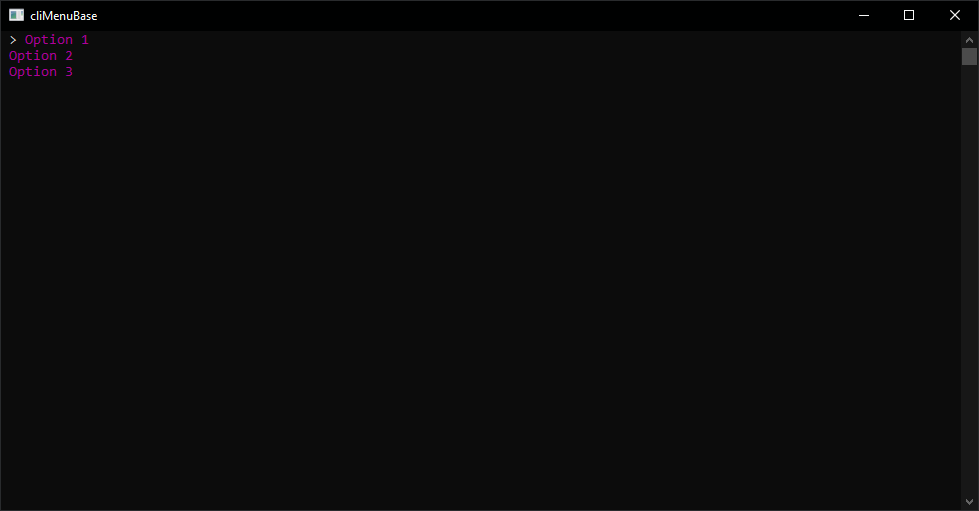

# cliMenuBase
This CLI/Console based menu is just a simple source for Skids which dont know how to use the origin of the ConsoleHelper.cs which basically does all the work
(Theres some fake delay on starting/executing code after an option is selected to make it look like the software is "busy" loading stuff since i noticed skids love to add this kind of bullshit)

  

